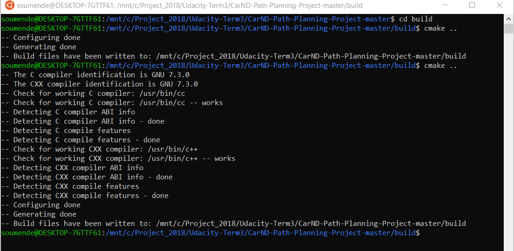
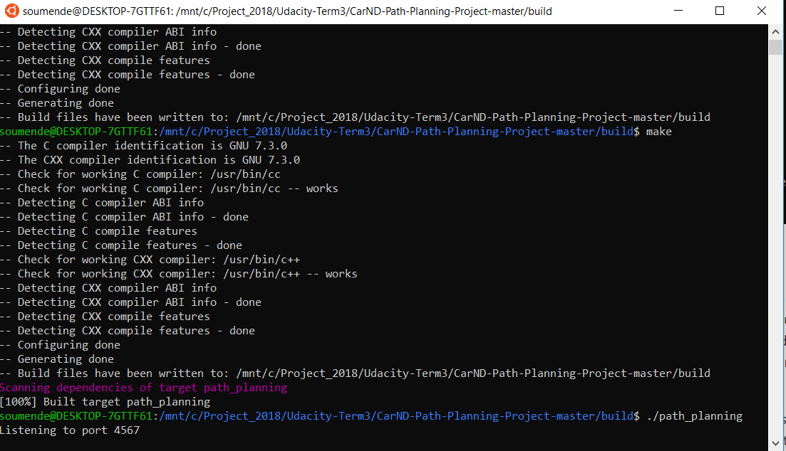
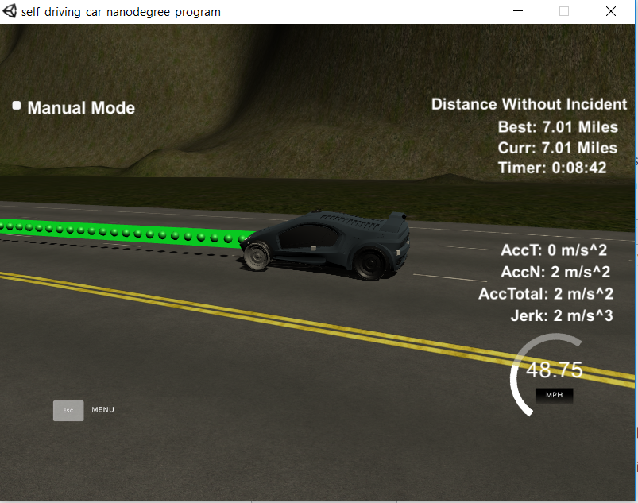

# CarND-Path-Planning-Project
Udacity Self-Driving Car Engineer Nanodegree Program, Term 3, Project 1

### Summary

In this project, the goal is to design a path planner that is able to create smooth, safe paths for the car to follow along a 3 lane highway with traffic. A successful path planner will be able to keep inside its lane, avoid hitting other cars, and pass slower moving traffic all by using localization, sensor fusion, and map data.

In this project, a spline function in order to drive a car around a simulated track, including performing lane changes as necessary when around traffic.

A video of my vehicle making it further than the required distance can be seen [here](https://www.youtube.com/watch?v=???).

### Simulator.
You can download the Term3 Simulator which contains the Path Planning Project from the [releases tab (https://github.com/udacity/self-driving-car-sim/releases/tag/T3_v1.2).  

## Basic Build Instructions

1. Clone this repo.
2. Make a build directory: `mkdir build && cd build`
3. Compile: `cmake .. && make`
4. Run it: `./path_planning`.

Here is the data provided from the Simulator to the C++ Program

#### Main car's localization Data (No Noise)

["x"] The car's x position in map coordinates

["y"] The car's y position in map coordinates

["s"] The car's s position in frenet coordinates

["d"] The car's d position in frenet coordinates

["yaw"] The car's yaw angle in the map

["speed"] The car's speed in MPH

#### Previous path data given to the Planner

//Note: Return the previous list but with processed points removed, can be a nice tool to show how far along
the path has processed since last time. 

["previous_path_x"] The previous list of x points previously given to the simulator

["previous_path_y"] The previous list of y points previously given to the simulator

#### Previous path's end s and d values 

["end_path_s"] The previous list's last point's frenet s value

["end_path_d"] The previous list's last point's frenet d value

#### Sensor Fusion Data, a list of all other car's attributes on the same side of the road. (No Noise)

["sensor_fusion"] A 2d vector of cars and then that car's [car's unique ID, car's x position in map coordinates, car's y position in map coordinates, car's x velocity in m/s, car's y velocity in m/s, car's s position in frenet coordinates, car's d position in frenet coordinates. 

# Rubic Points
## Compilation
The code compiles correctly. One spline (Cubic Spline interpolation implementation) library was used in this project:

## Valid Trajectories
### The car is able to drive at least 4.32 miles without incident.
The car was able to drive 10 miles without incidents:

### The car drives according to the speed limit.
The car was able to drive 7 miles without a red speed limit message.

### Max Acceleration and Jerk are not Exceeded.
The car was able to drive 10 miles without red max jerk message.

### Car does not have collisions.
The car was able to drive 10 miles without a collision.

### The car stays in its lane, except for the time between changing lanes.
The car doesn't spend more than a 3 second length out side the lane lanes during changing lanes, and every other time the car stays inside one of the 3 lanes on the right hand side of the road.

### The car is able to change lanes
The car change lanes when the there is a slow car in front of it, and it is safe to change lanes (no other cars around).

## Reflection
This project uses the provided code from the seed project. A lot of the concepts (splines, etc) were taken from the Q&A video that is provided by Udacity. I added additional comments to the code to improve the readability. The functionality is separated into 3 main parts: Prediction, Behaviour Planning and Trajectory Calculation.

Path planning: This module is in charge of planning the vehicle trajectory up to a specific goal.
The path planning module is using as inputs:
- the sensor fusion outputs
- the map and localization

It then provides as output a set of waypoints to follow.

The Path Planning module is typically decomposed into the following set of sub-modules:

<B>predictions:</B> will predict the trajectories of the surrounding detected objects

<B> behaviour planner: </B> will define a set of candidate high level targets for the vehicle to follow (lane changes, slow down …)

<B> trajectories generation:</B> for every possible high level targets, a percise path to follow will be computed

<B> trajectories cost ranking:</B> for each trajectory a cost will be derived (depending on feasibility, safety, legality, comfort and efficiency) and the trajectory with the lowest cost will be chosen

### Detailed Implementation

In `main.cpp`, after the data from the simulator is pulled in, I first check whether there is any remaining path left [./src/main.cpp](./src/main.cpp#L248) line 248). If it is the first time around, this means I have to initiate my points to later be used in a spline function to be equal to where the car is right now [./src/main.cpp](./src/main.cpp#L266)(lines 266-278). If there is a remaining path, this will get pushed back into the x and y coordinates to be fed the simulator again. Additionally, I calculate the x, y, yaw and velocity based off the end values of the remaining path, in order to have the behavior planner begin from the end of the old path [./src/main.cpp](./src/main.cpp#L279)(lines 279-295).

Next, I need to change my x & y coordinates into frenet coordinates, s & d [./src/main.cpp](./src/main.cpp#L298)(line 298). In frenet, "s" is the distance along a lane while "d" is the distance away from the center dividing line of the road (at least in the simulator). By converting these, it makes it easier to calculate where I want to be on the road, as I can tell it exactly where in each lane to be.

Now it's time for the behavior planner itself. In `behavior.cpp`, I start by calculating which lane I am in based off of "d" - "0" for the left lane in my direction, "1" for the middle lane, and "2" for the right lane. I then check how close the car in front of me is with `ClosestVehicle()`, which can be set to look either in front of or behind my vehicle's "s" position in different lanes. In this case, I first am just checking in front of my car - if the closest vehicle in my lane is more than 20 meters away, I want to drive near the speed limit and hold my lane.

The interesting part comes if my car does have another car close in front of it. This is where `laneScore()` comes in. This iterates through all three lanes, and checks both in front of and behind my car for the closest vehicles. I added a slight benefit to holding my lane, with higher negative values if there are cars too close in front or behind my vehicle, as I would want to avoid changing lanes at that point (or staying in my own lane) because an accident would likely occur. There are then benefits (or costs) depending on how much distance there is in front and behind the vehicles in the given lane and what speed those vehicles are going.

These scores are then taken as an "average" of the last ten scores for that lane (not exactly, but in a simplified manner), and then the best scoring lane is returned from the function. Back into `lanePlanner()`, I then make sure to keep the vehicle's speed in front of me in the lane I want to move to (or keep) so that I can match it. Finally, `lanePlanner()` returns a move in meters - "0" if keeping the same lane, "-4" if changing lanes left, and "4" if changing lanes right.

This brings it back into `main.cpp`, where the next "d" value gets calculated (line 302) to be used in setting waypoints for the spline function. However, there is still one last check performed to make sure that the lane desired is actually going to be open for our move [./src/main.cpp](./src/main.cpp#L304)(lines 304-315) - if it isn't, then the lane gets reset to the current one, and the target speed is reset to the old vehicle being followed.

Finally, it's time to make waypoints for the spline function. Based off the new desired "d", I equally space out the waypoints by fifty meters - too much shorter sometimes caused it to exceed max acceleration/jerk. These, along with any from the old path (or the car starting point if initializing) are then shifted and rotated so that they are local to my own vehicle (lines 330-338). This helps to ensure the spline can work correctly, as the x-values need to be in order, and we want to the be correctly spaced out going forward.

After setting the spline, I use the spline to come up with new points along that spline. For each point, I space them out over the target distance using the current (per the calc) velocity over 0.02 seconds, as the simulator moves every 20 milliseconds. For each point, I compare the velocity (`ref_vel`) to my target vehicle's speed, and either accelerate or deccelerate based on where I am in comparison. The "x" value is then changed by the distance traveled at that speed, and "y" is calculated off the spline value for that "x". These points are then rotated and shifted back to global coordinates, and fed to the simulator to drive!
